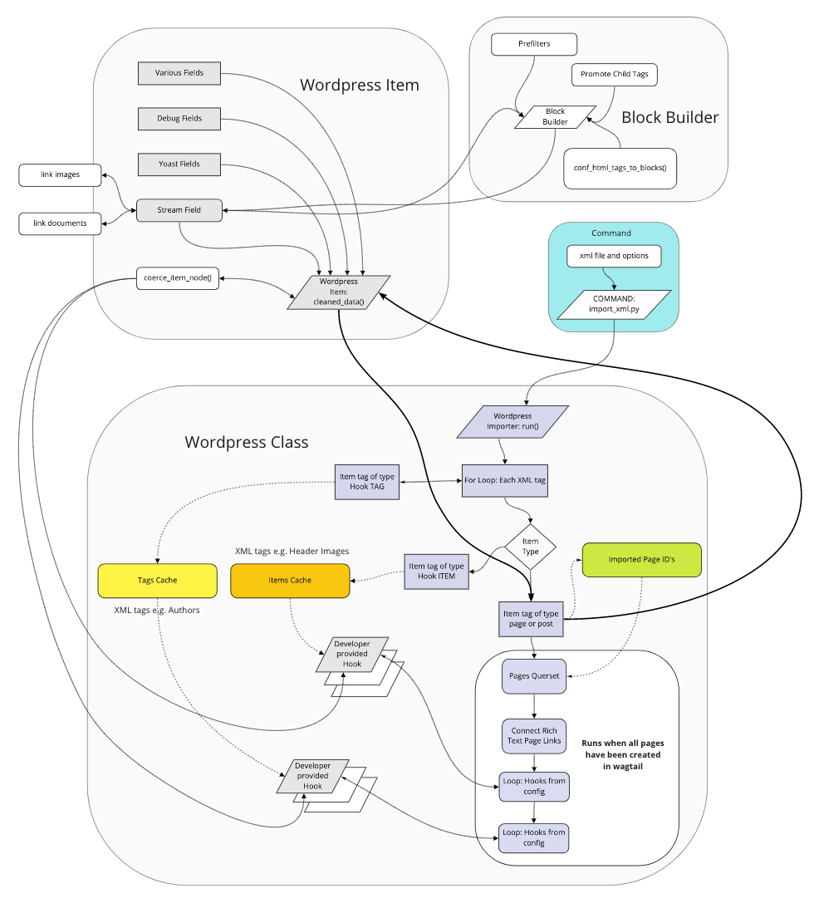

# Import process

The import is started by the Django management command:

```bash
python manage.py import_xml path/to/xml/file.xml parent_page_id
```

but what happens afterwards is complicated, and highly configurable:

```html

```

## `import_xml` Command

We assume here that you have a full XML export of a WordPress site. You should at least have considered using  [analyse](tooling.md#analyze-xml-commands) and [reduce](tooling.md#reduce-xml-command), before you run the import.

Then, when you run the `import_xml` command it creates an `importers.wordpress.WordpressImporter` instance, which handles the rest of the import.

## Walk through the XML

`WordpressImporter` begins by looking at each XML node tag in turn.

If the node is registered in settings for cacheing until later, see [Cache tags and items for later](#cache-tags-and-items-for-later).

Otherwise, if the node is a WordPress post or page, the import creates a `WordPressItem` instance to clean and process it.

All other nodes are ignored.

### WordpressItem

The item is checked to see whether it represents an existing Wagtail `Page` instance, and a page is either created or updated accordingly.

The item is processed for any categories, if that feature is enabled. See [Categories import](categories_import.md).

The item is cleaned. This:

- Cleans various fields, including:
- - trimming whitespace from text fields
- - validating dates
- - formatting slugs
- - SEO-related fields (see also [Yoast Plugin documentation](yoast.md))
- Pre-filters the body field, to clean up WordPress quirks of the HTML. Pre-filters are a series of cumulative functions. These are configurable. See [Pre-filters](prefilters.md).
- Converts the body to a series of StreamField blocks. The mapping of HTML to StreamField blocks is configurable. See [Block Builder](blockbuilder.md).
- - This stage also includes importing images from the source site, and modifying HTML `img` tags to link to the imported Image instance instead.
- Converts any `wp:post_meta` tag nodes to a dict, which we can query later using Django's JSONField.

### Update and save the page

The package assumes that your own target `Page` model has an `.import_wordpress_data` function that maps the cleaned data to the available fields.

The page is saved, and published according to the WordPress live/draft status. The page ID is added to a list for later.

### Cache tags and items for later

[Import Hooks Documentation](import_hooks.md)

If the XML node is configured in settings for cacheing until later, it will be stored in `WordpressImporter.tags_cache` (for top-level tags such as authors), or `.items_cache`. Nodes that are suitable for this are those such as references to objects elsewhere in the XML, for example a header image, or an author link. We can't create the relationship until both objects have been imported.

The cache will use a key, e.g, `"wp:author"`, to store a list of unique author entities found.

Your settings will also have specified a function to be run after walking the XML, see [Run registered functions](#run-registered-functions).

## After walking the XML

Once all nodes are processed, and either imported as `Page` objects, or cached for later, some processing involving database relations is possible.

### Connect rich text page links

If page body StreamField contains RichText blocks with HTML `a` elements linking to relative URLs, the importer attempts to convert these to dynamic Wagtail references to `Page` objects.

### Run registered functions

These are configurable functions to process cached tags and items, and create the ForeignKey relationships they represent. If an XML node has been configured for cacheing until later, a corresponding function will have been registered to process the cached data.

It is up to developers using this package to write these functions. They receive a queryset of imported pages (this query uses the list of page IDs stored earlier by the importer class), and the cached data.

For the author example previously, this function might handle getting the `Author` model instance (or creating a new one) for each entry found in the cache, and then querying the imported pages, and linking them to this author.

As the `wp:post_meta` tag of pages was cleaned and stored in a JSON field, it is possible to query all pages which refer to this author in their WordPress metadata, and update them with actual database links.

See [Import Hooks](import_hooks.md).
